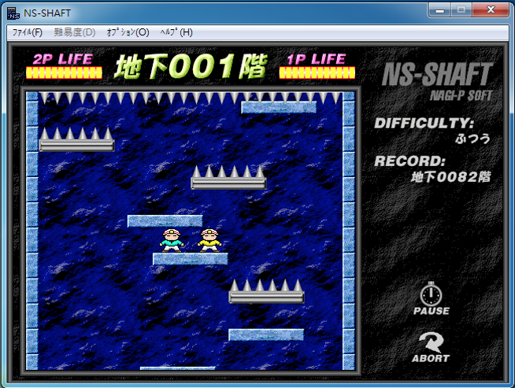

# Software Studio 2018 Spring Assignment 02 小朋友下樓梯

## 小朋友下樓梯
</img>

## Goal
1. **Fork the repo ,remove fork relationship and change project visibility to public.**
2. Complete a game "小朋友下樓梯" by Phaser. (JavaScript or TypeScript)
3. Your game should reach the basic requirements.
4. You can download needed materials from some open source webpage to beautify the appearance.
5. Commit to "your" project repository and deploy to Gitlab page.
6. **Report which items you have done and describing other functions or feature in REABME.md.**

## Scoring 
|                                              Item                                              | Score |
|:----------------------------------------------------------------------------------------------:|:-----:|
| A complete game process: start menu => game view => game over => quit or play again            |  20%  |
| Your game should follow the basic rules of  "小朋友下樓梯".                                    |  15%  |
|         All things in your game should have correct physical properties and behaviors.         |  15%  |
| Set up some interesting traps or special mechanisms. .(at least 2 different kinds of platform) |  10%  |
| Add some additional sound effects and UI to enrich your game.                                  |  10%  |
| Store player's name and score in firebase real-time database, and add a leaderboard to your game.        |  10%  |
| Appearance (subjective)                                                                        |  10%  |
| Other creative features in your game (describe on README.md)                                   |  10%  |

## Reminder
* Do not make any change to our root project repository.
* Deploy your web page to Gitlab page, and ensure it works correctly.
    * **Your main page should be named as ```index.html```**
    * **URL should be : https://[studentID].gitlab.io/Assignment_02**
* You should also upload all source code to iLMS.
    * .html or .htm, .css, .js, .ts, etc.
    * source files
* **Deadline: 2018/05/24 23:59 (commit time)**
    * Delay will get 0 point (no reason)
    * Copy will get 0 point
    * "屍體" and 404 is not allowed  


## Report
|                                              Item                                              | Score |
|:----------------------------------------------------------------------------------------------:|:-----:|
| 遊戲state有主畫面，遊戲本體和死亡頁面。在主畫面按start button進入遊戲本體，死亡後進入死亡頁面，死亡頁面右下角的home可以回到主畫面，玩家按ENTER可以回到遊戲本體 |  20%  | 
| 和小朋友下樓梯規則雷同，碰到尖刺扣生命值，超出遊戲畫面直接死亡                                       |  15%  |
| 左右輸送帶，假樓梯，和跳墊各有不同效果                                                             |  15%  |
| 跟小朋友下樓梯一樣，有左右輸送帶，假樓梯，和跳墊                                                    |  10%  |
| 玩家在不同階梯會產生不同音效，主畫面和死亡畫面都有背景音樂，介面按鈕有hover功能，有些text加入tween效果  |  10%  |
| 在剛進入遊戲本體時要求玩家輸入名稱，在死亡畫面會顯示玩家本次遊戲到第幾樓，畫面下方有LEADERBOARD寫前五名的玩家分別到第幾樓層 |  10%  |
| 遊戲title字體精心設計，畫面簡約，圖片和特效自然揉合在一起，背景音效選用迷幻風格，豐富遊戲體驗           |  10%  |
| 增加生命提升功能，遊戲畫面隨機產生愛心，玩家吃到愛心可增加生命上限值                                  |  10%  |
